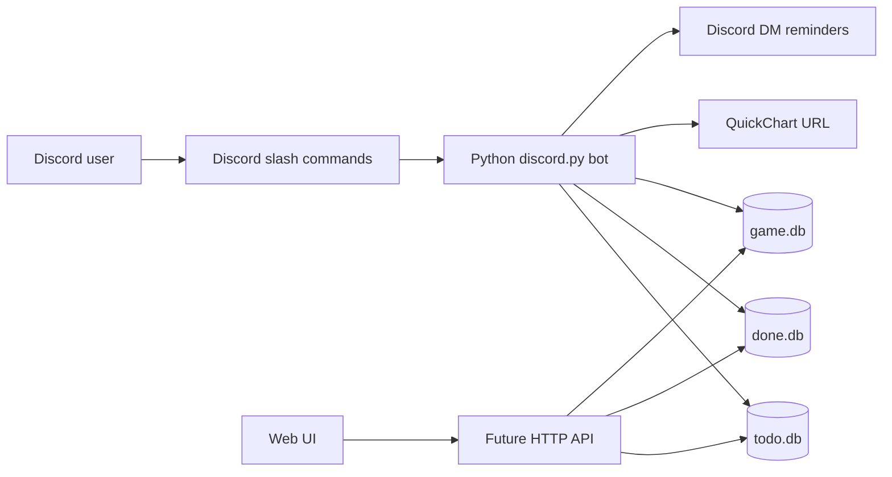
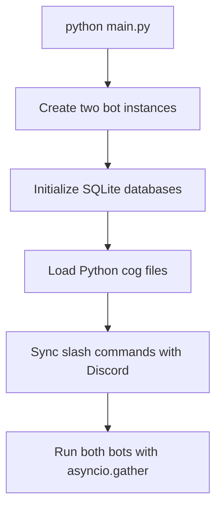
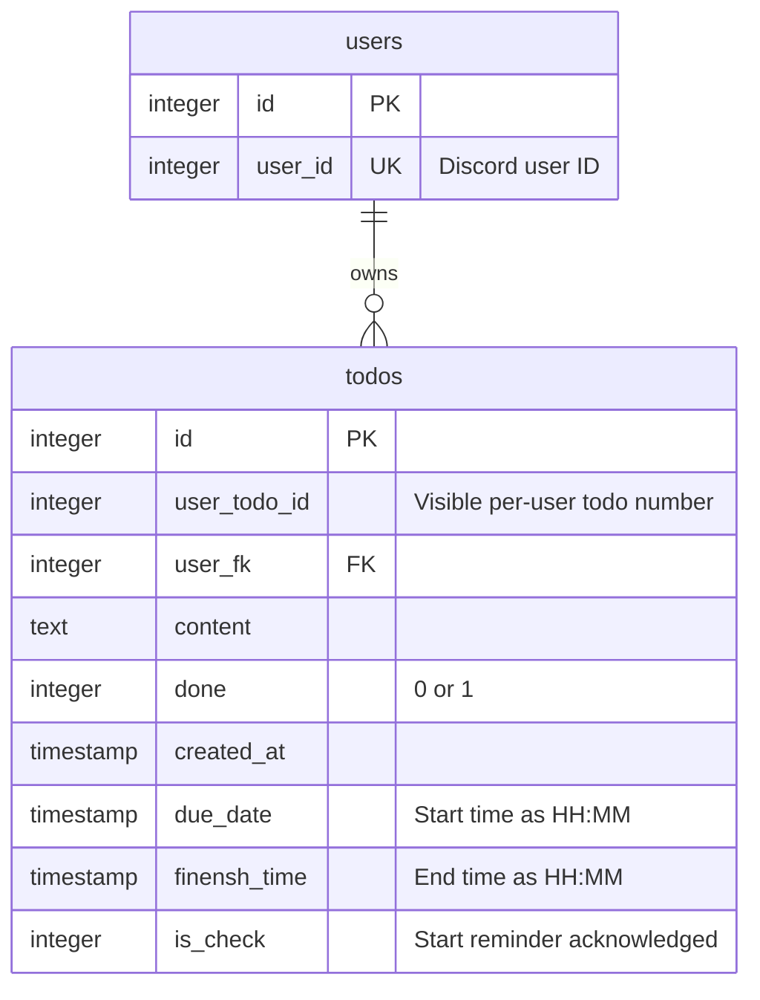
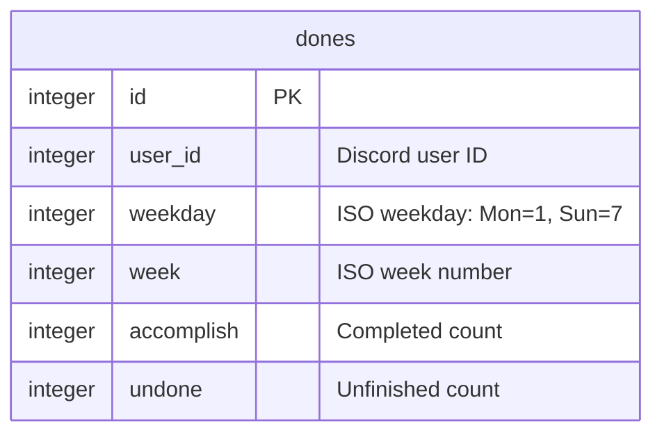
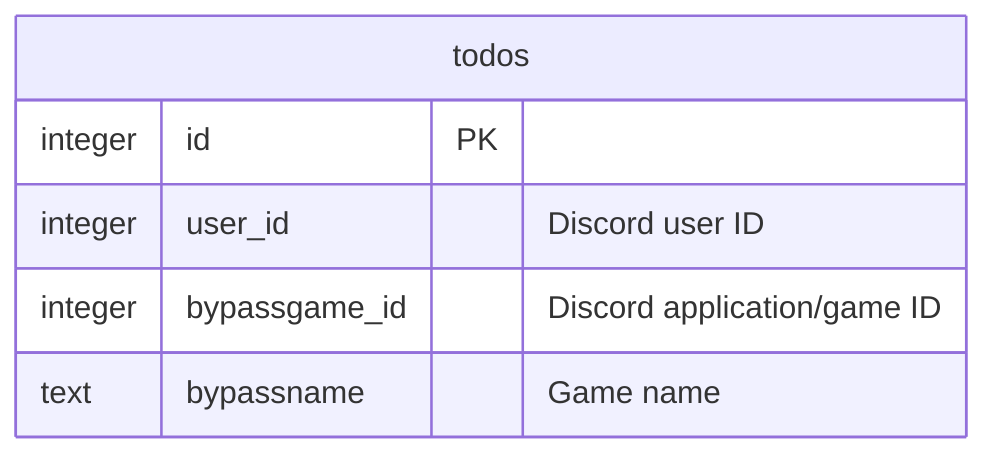

# ConcentrateBot

ConcentrateBot is a Discord bot for time-based todo and focus tracking.

Users create focus tasks in Discord, the bot reminds them when a task starts and ends, records completed tasks for weekly analytics, and can warn a user if Discord detects that they are playing a non-allowed game during an active focus session.

The project is currently mostly the Discord bot and data-analysis side. The web UI can be built as a separate app if it talks to the same data through a small API layer.

## Why Split Bot And UI

From the Discord chat:

- One part can be data analysis / Discord bot logic.
- One part can be UI.
- Splitting them is better because one all-in-one project becomes harder to maintain.

Suggested ownership:

| Part | Main job | Current status |
| --- | --- | --- |
| Discord bot | Slash commands, reminders, game detection, writes SQLite data | Exists |
| Web UI | Todo dashboard, charts, settings, user-facing web screens | To build |
| API layer | HTTP bridge between web UI and SQLite/bot logic | To build |

## Big Picture



Think of the Python code as three layers:

1. Discord command/UI layer: modals, buttons, dropdowns, embeds.
2. Background worker layer: loops that check time and Discord activity every 10 seconds.
3. Data layer: SQLite helper functions.

As a web/full-stack engineer, the most important part for you is the data layer plus the future API contract. You do not need to fully understand every Discord UI object to build the web UI.

## Project Tree

```text
.
├── main.py
├── README.md
└── dm_cogs
    ├── bypasswhat.py
    ├── checkgame.py
    ├── databass
    │   ├── SQL_dm.py
    │   ├── game.db
    │   └── init_db.py
    └── cogs
        ├── check_date.py
        ├── emdtime.py
        ├── respond.py
        ├── todo.py
        └── databass
            ├── SQL.py
            ├── SQL_done.py
            ├── picture.py
            ├── todo.db
            └── done.db
```

Notes:

- `databass` is probably meant to be `database`.
- `finensh_time` is probably meant to be `finish_time`.
- These names are used by code/database files, so rename them only with a migration/refactor.

## Startup Flow

File: `main.py`



There are two bot classes:

| Class | Prefix | Loads | Purpose |
| --- | --- | --- | --- |
| `MyBot` | `!` | `dm_cogs/cogs/*.py` | Main todo/focus bot |
| `dmbot` | `?` | `dm_cogs/*.py` | Bypass-game and game-check side |

`main.py` also defines admin-style prefix commands:

| Command | What it does |
| --- | --- |
| `!reloud <extension>` | Reloads one main cog |
| `!reloud_all` | Reloads all main cogs and syncs commands |
| `!reset` | Deletes all todo rows |
| `?dm_reloud_all` | Reloads second-bot cogs |

Security warning: Discord bot tokens are currently hardcoded in `main.py`. Rotate those tokens in the Discord Developer Portal before sharing the repo, then move them into environment variables.

## Discord Commands

### Todo Commands

File: `dm_cogs/cogs/todo.py`

| Command | User action | Data effect |
| --- | --- | --- |
| `/add` | Opens a modal to create a todo/focus block | Inserts into `todo.db.todos` |
| `/get_list` | Shows the user's todo list and weekly chart | Reads `todo.db` and `done.db` |
| `/done` | Opens a dropdown to mark complete or delete | Updates/deletes `todo.db.todos`; completion also updates `done.db.dones` |
| `/del <id>` | Deletes a todo by the user's visible todo number | Deletes from `todo.db.todos` and renumbers that user's later todos |

`/add` asks for:

- Todo content
- Start hour
- Start minute
- Duration hours
- Duration minutes

Validation currently done by the bot:

- Input must be parseable as numbers.
- New task cannot overlap another task for the same user.
- Task cannot pass midnight; it must end today.

Important behavior: start/end times are stored as `HH:MM` strings, not full datetimes.

### General Commands

File: `dm_cogs/cogs/respond.py`

| Command | What it does |
| --- | --- |
| `!ping` | Replies with bot latency |
| `/echo` | Sends a test embed; this looks like a development command |

### Bypass Game Commands

File: `dm_cogs/bypasswhat.py`

| Command | What it does |
| --- | --- |
| `/addbypass` | Reads the user's current Discord activity and saves that game as allowed |
| `/remove` | Shows a dropdown so the user can remove an allowed game |

`/addbypass` only works in a Discord server because it uses `interaction.guild.get_member(...)` and reads the member's current activities.

## Background Jobs

### Start Reminder

File: `dm_cogs/cogs/check_date.py`

Every 10 seconds:

1. Current time is formatted as `HH:MM`.
2. Bot finds unfinished todos where `due_date <= now` and `is_check = 0`.
3. Bot DMs the user: task time has arrived.
4. DM includes a `check` button.
5. Clicking `check` sets `is_check = 1`.

SQL helper involved:

```text
get_all_check(now)
check(user_id, user_todo_id)
```

### End Reminder

File: `dm_cogs/cogs/emdtime.py`

Every 10 seconds:

1. Current time is formatted as `HH:MM`.
2. Bot finds unfinished todos where `finensh_time <= now`.
3. Bot DMs the user: task has ended.
4. DM includes an `add 10 min` button.
5. Clicking the button updates `finensh_time` by adding 10 minutes.

SQL helper involved:

```text
get_end_time(now)
add_time(user_id, user_todo_id, new_time)
```

### Game Detection

File: `dm_cogs/checkgame.py`

Every 10 seconds:

1. Bot finds todos active right now.
2. Bot checks members in one hardcoded Discord server.
3. Bot reads each member's current Discord activities.
4. If a user is playing a game and that game is not in their bypass list, the bot sends a DM warning.

Current hardcoded server ID:

```text
1490737355202760804
```

This should move to an environment variable later.

## Database Model

The bot uses SQLite through `aiosqlite`.

### Todo Database

File: `dm_cogs/cogs/databass/todo.db`

Code: `dm_cogs/cogs/databass/SQL.py`



Main helper functions:

| Function | Rough API meaning |
| --- | --- |
| `add_todo(user_id, content, due_date, finensh_time)` | Create todo |
| `get_all_todos(user_id)` | List todos for one Discord user |
| `get_todos(user_id, user_todo_id)` | Get one todo by visible todo number |
| `done_todo(user_id, user_todo_id)` | Mark todo complete |
| `DEL_todo(user_id, user_todo_id)` | Delete todo and renumber |
| `get_all_check(now)` | Find todos needing start reminders |
| `get_all_game_check(now)` | Find todos active right now for game detection |
| `get_end_time(now)` | Find todos needing end reminders |
| `add_time(user_id, user_todo_id, time)` | Extend/update end time |
| `del_all()` | Delete all todos |

Example SQL join used by reminder jobs:

```sql
SELECT todos.content, users.user_id, todos.done, todos.finensh_time, todos.user_todo_id
FROM todos
JOIN users ON todos.user_fk = users.id
WHERE (todos.due_date = ? OR todos.due_date < ?)
  AND todos.is_check = 0
  AND todos.done = 0;
```

### Done / Analytics Database

File: `dm_cogs/cogs/databass/done.db`

Code: `dm_cogs/cogs/databass/SQL_done.py`



Behavior:

- When a todo is marked done, `addone(user_id)` increments `accomplish` for today's weekday and week.
- `/get_list` reads this data and creates a weekly line chart URL with QuickChart.
- `undone` exists but is not really wired into the current todo flow yet.

Chart code:

```text
dm_cogs/cogs/databass/picture.py
```

### Bypass Game Database

File: `dm_cogs/databass/game.db`

Code: `dm_cogs/databass/SQL_dm.py`

The table is named `todos`, but it stores bypass games.



Main helper functions:

| Function | Rough API meaning |
| --- | --- |
| `add_todo(user_id, bypassgame_id, bypassname)` | Add allowed game |
| `get_all_bypass(user_id)` | List allowed games |
| `DEL_todo(user_id, bypassgame_id)` | Remove allowed game |
| `get_todos(user_id, selected_id)` | Get one allowed game |

Suggested future rename:

| Current name | Better name |
| --- | --- |
| `dm_cogs/databass` | `dm_cogs/database` |
| `game.db.todos` | `bypass_games` |
| `bypassgame_id` | `game_id` |
| `bypassname` | `game_name` |

## What The Web UI Can Catch

There is no HTTP API yet. The Discord bot directly reads/writes SQLite.

The web UI should not talk directly to the `.db` files from browser JavaScript. A browser needs a backend. The clean path is:

```text
Web UI -> HTTP API -> SQLite helper/data layer
Discord bot -> SQLite helper/data layer
```

### Recommended API Endpoints

| Method | Path | Purpose | Maps to |
| --- | --- | --- | --- |
| `GET` | `/api/users/{discordUserId}/todos` | List todos | `get_all_todos` |
| `POST` | `/api/users/{discordUserId}/todos` | Create todo | `add_todo` plus same validation as `/add` |
| `GET` | `/api/users/{discordUserId}/todos/{todoId}` | Get one todo | `get_todos` |
| `PATCH` | `/api/users/{discordUserId}/todos/{todoId}/done` | Mark done | `done_todo` and `addone` |
| `PATCH` | `/api/users/{discordUserId}/todos/{todoId}/end-time` | Extend/change end time | `add_time` |
| `DELETE` | `/api/users/{discordUserId}/todos/{todoId}` | Delete todo | `DEL_todo` |
| `GET` | `/api/users/{discordUserId}/weekly-stats` | Weekly completion chart data | `get_weekly_data` |
| `GET` | `/api/users/{discordUserId}/bypass-games` | List allowed games | `get_all_bypass` |
| `POST` | `/api/users/{discordUserId}/bypass-games` | Add allowed game manually | `add_todo` in `SQL_dm.py` |
| `DELETE` | `/api/users/{discordUserId}/bypass-games/{gameId}` | Remove allowed game | `DEL_todo` in `SQL_dm.py` |

Example todo response for the UI:

```json
[
  {
    "id": 1,
    "content": "Study math",
    "done": false,
    "startTime": "20:00",
    "endTime": "21:30",
    "checked": false
  }
]
```

Example create-todo request:

```json
{
  "content": "Build web dashboard",
  "startTime": "14:00",
  "durationMinutes": 90
}
```

Example weekly stats response:

```json
{
  "week": 29,
  "days": [
    { "weekday": 1, "label": "Mon", "completed": 2, "undone": 0 },
    { "weekday": 2, "label": "Tue", "completed": 1, "undone": 0 },
    { "weekday": 3, "label": "Wed", "completed": 0, "undone": 0 }
  ]
}
```

Example bypass game response:

```json
[
  {
    "gameId": 123456789,
    "name": "Visual Studio Code"
  }
]
```

## UI Screens To Build

Good first web UI scope:

- Discord user ID input or login placeholder
- Today timeline
- Todo list with done/delete actions
- Add todo form with start time and duration
- Weekly completion chart
- Bypass game list

Later:

- Discord OAuth login
- Settings for reminder behavior
- Admin page for guild/server ID
- Better analytics: completion rate, focus minutes, missed sessions

## Important Implementation Details

### Time Handling

Current code stores only `HH:MM`. This is easy for today's todos, but it has limits:

- No date is stored for a focus session.
- Tasks cannot cross midnight.
- Comparing times as strings works only because format is always zero-padded `HH:MM`.

For a future API, consider storing full timestamps:

```text
start_at: 2026-07-12T14:00:00+08:00
end_at:   2026-07-12T15:30:00+08:00
```

### IDs

There are two todo IDs:

| Field | Meaning |
| --- | --- |
| `todos.id` | SQLite row ID |
| `todos.user_todo_id` | Per-user visible todo number used by Discord commands |

The current Discord commands use `user_todo_id`. If the API uses it too, document that clearly. For a cleaner backend, expose stable database IDs or UUIDs later.

### Completion Analytics

Marking a todo done updates two places:

1. `todo.db.todos.done = 1`
2. `done.db.dones.accomplish += 1`

Your API should do both in one endpoint. Otherwise the UI may mark an item done but the chart will not update.

### Discord Activity Detection

Game detection depends on Discord privileged intents:

- Message Content Intent
- Server Members Intent
- Presence Intent

The web UI cannot detect Discord activities by itself unless it goes through Discord APIs/OAuth and has the right permissions. For now, treat bypass-game management as a settings screen over `game.db`.

## Current Dependencies

There is no `requirements.txt` yet. The code imports:

```text
discord.py
aiosqlite
```

Install example:

```bash
pip install discord.py aiosqlite
```

QuickChart is used by URL generation:

```text
https://quickchart.io/chart
```

## Running The Bot

Current command:

```bash
python main.py
```

Before running:

1. Install dependencies.
2. Create Discord bot applications.
3. Enable required Discord privileged intents.
4. Move tokens out of `main.py`.
5. Start the bot.

Recommended token setup:

```bash
export DISCORD_BOT_TOKEN="your-main-bot-token"
export DISCORD_DM_BOT_TOKEN="your-second-bot-token"
export DISCORD_GUILD_ID="1490737355202760804"
python main.py
```

Then `main.py` should read:

```python
TOKEN = os.getenv("DISCORD_BOT_TOKEN")
DM_token = os.getenv("DISCORD_DM_BOT_TOKEN")
```

## Suggested Next Steps

1. Add `requirements.txt`.
2. Move Discord tokens and server ID into environment variables.
3. Add a small API server.
4. Move shared DB helpers into a cleaner `database/` or `services/` folder.
5. Build the web UI against the API instead of Discord internals.
6. Later, migrate time fields from `HH:MM` strings to full datetimes.
7. Later, rename confusing fields/tables with a migration.
