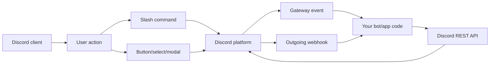
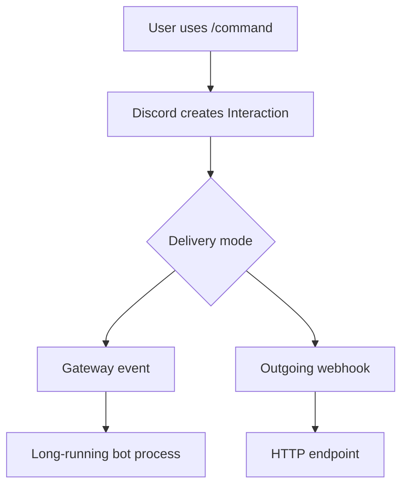

# 01. Platform Map

Discord apps are integrations that can run inside Discord. A bot is one kind of Discord app: it has a bot user, can join servers, can receive events, and can respond to users.

For ConcentrateBot, the useful mental model is:

## Main Concepts

| Concept | Meaning | In this project |
| --- | --- | --- |
| Application | The app registered in Discord Developer Portal | Your Discord bot app |
| Bot user | Automated Discord account attached to the app | `MyBot` and `dmbot` log in as bot users |
| Guild | Discord server | Game detection checks one hardcoded guild |
| Channel | Place where messages happen | Commands can happen in guild/DM contexts |
| Interaction | User triggered command/component/modal event | `/add`, `/done`, button clicks |
| Gateway | WebSocket event stream from Discord | `discord.py` uses it under the hood |
| REST API | HTTP API for actions/data | Sending messages, registering commands, fetching users |
| OAuth2 | Authorization system for installs/login/scopes | Future web login can use this |

## Important Architecture Choice

Discord interactions can reach your app two ways:

This repo currently uses the Gateway path through `discord.py`. That means the Python bot is a long-running process connected to Discord.

For a future web UI/API, you probably want a separate HTTP API for your own frontend. That API is not the same as Discord's interaction webhook endpoint, although both are HTTP servers.

## Official Docs To Read

- Discord Developer Platform: https://docs.discord.com/developers/intro
- Overview of Apps: https://docs.discord.com/developers/quick-start/overview-of-apps.md
- Bots & Companion Apps: https://docs.discord.com/developers/bots/overview.md
- Interactions Overview: https://docs.discord.com/developers/interactions/overview.md
