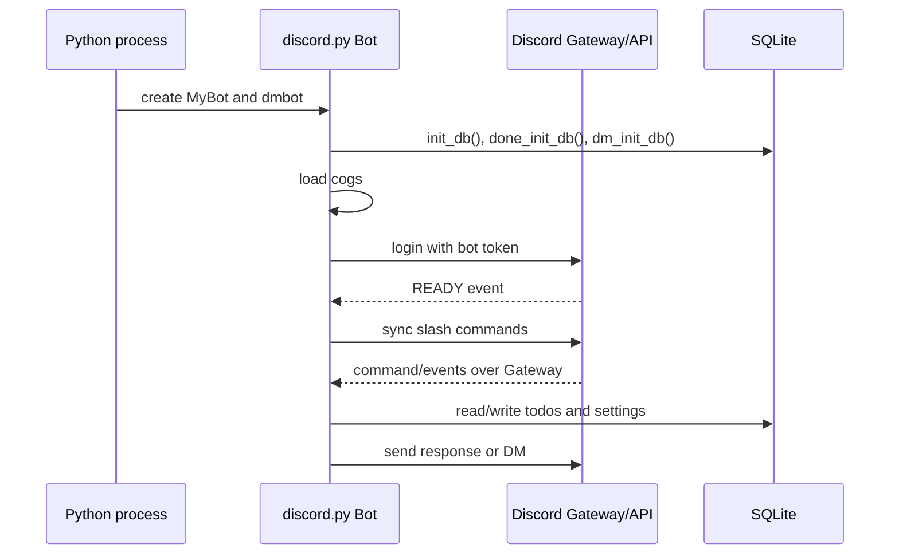
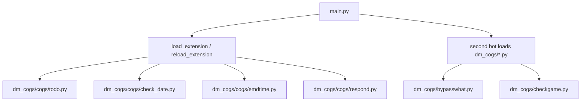

# 02. Bot Lifecycle

A Discord bot is usually a long-running process:

1. Load configuration.
2. Create a client/bot object.
3. Choose intents.
4. Register/load command modules.
5. Connect to Discord Gateway.
6. Receive events.
7. Respond through library calls that use Discord's APIs.

In this repo, `main.py` does that with `discord.py`.

## How This Maps To `main.py`

| Code | Meaning |
| --- | --- |
| `commands.Bot(...)` | Creates a Discord bot client |
| `command_prefix="!"` | Enables old-style text commands like `!ping` |
| `discord.Intents.default()` | Starts with default event permissions |
| `intents.message_content = True` | Allows reading raw message text for prefix commands |
| `intents.members = True` | Allows member data |
| `intents.presences = True` | Allows presence/activity data |
| `setup_hook()` | Initializes DBs and loads cogs before ready |
| `on_ready()` | Runs after bot connects and is ready |
| `self.tree.sync()` | Syncs slash commands to Discord |

## Cogs

A cog is a module/class used to group commands or event logic.

## Study Notes

- Bot tokens are secrets. Keep them out of Git.
- A connected bot can receive Gateway events.
- Slash commands need to be registered/synced before users see them.
- Prefix commands require message content access, but slash commands usually do not.

## Official Docs To Read

- Gateway: https://docs.discord.com/developers/events/gateway.md
- Gateway Events: https://docs.discord.com/developers/events/gateway-events.md
- Bots & Companion Apps: https://docs.discord.com/developers/bots/overview.md
