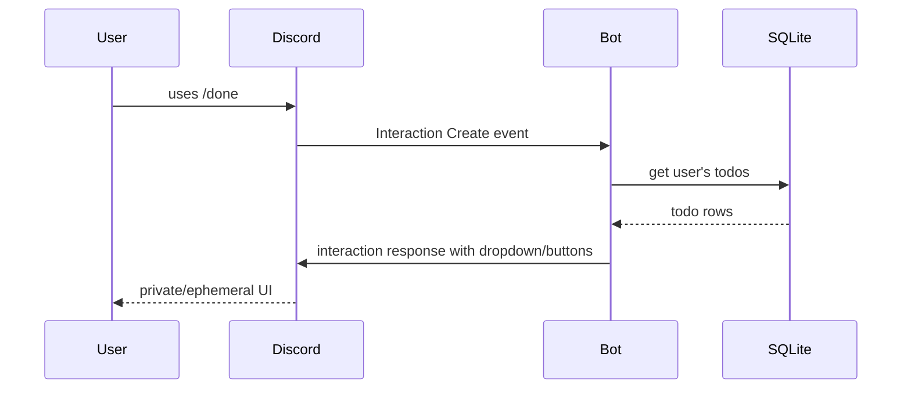
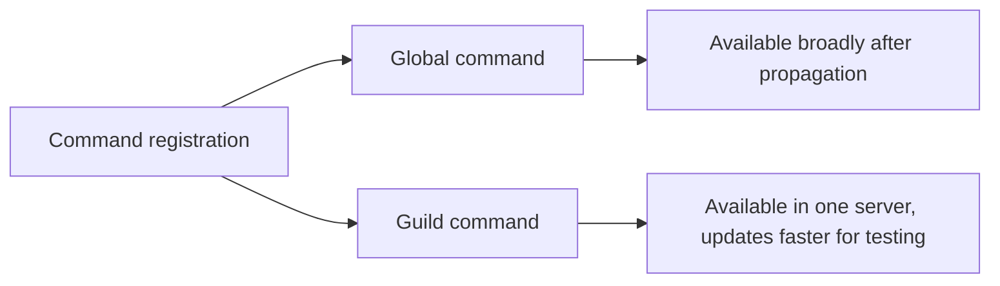

# 03. Commands And Interactions

Application commands are Discord-native commands. Slash commands are the most common type.

In this repo:

```python
@app_commands.command(name="add", description="新增待辦事項")
async def add(self, interaction):
    await interaction.response.send_modal(AddTodoModal())
```

That decorator registers a slash command named `/add`.

## Command Types

| Type | User sees it where? | Example use |
| --- | --- | --- |
| Chat input command | User types `/command` | `/add`, `/done` |
| User command | Right-click/tap a user | "View focus stats" |
| Message command | Right-click/tap a message | "Create todo from message" |

## Interaction Flow



## Important Terms

| Term | Meaning |
| --- | --- |
| Interaction | Payload created when a user uses a command/component/modal |
| Interaction response | First response to that interaction |
| Follow-up message | Later message using the interaction token |
| Ephemeral | Only visible to the user who triggered it |
| Command sync | Register/update command definitions with Discord |

## Global vs Guild Commands



For development, guild commands are often faster. This repo uses `self.tree.sync()` without a guild override, so it syncs according to the app command tree configuration.

## For Web Engineers

Slash commands feel similar to HTTP endpoints:

| Web API idea | Discord slash command equivalent |
| --- | --- |
| Route path | Command name |
| Request body/query | Command options or modal fields |
| Auth user | `interaction.user` |
| Response JSON/HTML | Discord message/embed/component response |
| Private response | `ephemeral=True` |

But there is one big difference: the user is not calling your server directly. Discord receives the user action first, then sends an interaction to your app.

## Official Docs To Read

- Application Commands: https://docs.discord.com/developers/interactions/application-commands
- Receiving and Responding: https://docs.discord.com/developers/interactions/receiving-and-responding
- Interactions Overview: https://docs.discord.com/developers/interactions/overview.md
