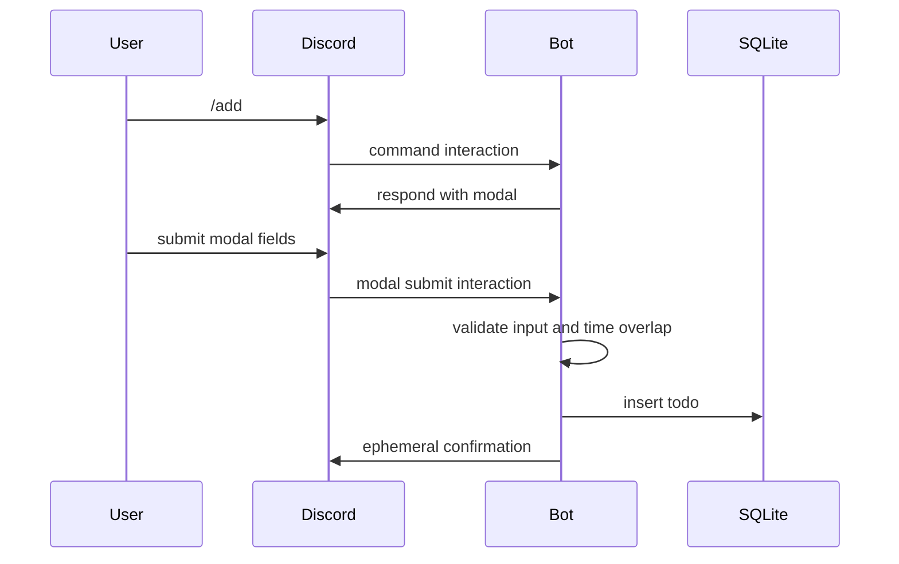
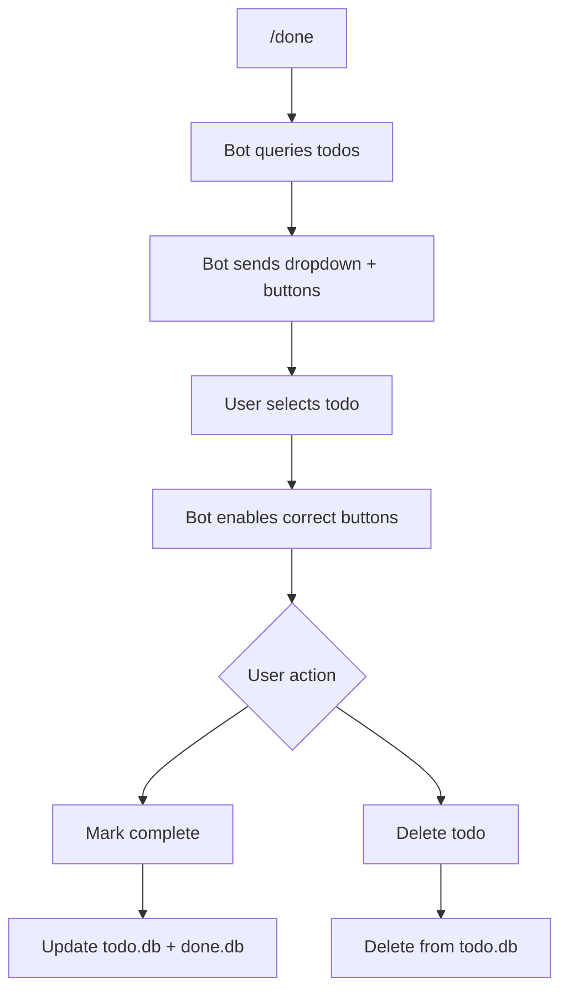

# 04. Components And Modals

Components are interactive UI elements inside Discord messages. Modals are popup forms.

This project uses:

- Modal text inputs for `/add`
- Select dropdowns for `/done` and `/remove`
- Buttons for confirm/delete/check/add time

## Component Map In This Repo

| Discord UI | Code class | Purpose |
| --- | --- | --- |
| Modal | `AddTodoModal` | Collect todo content/start/duration |
| Select dropdown | `DoneSelect` | Pick a todo or bypass game |
| View | `DoneView`, `CheckView`, `Check` | Container for buttons/selects |
| Button | `check_confirm`, `del_confirm` | Complete, delete, acknowledge, extend time |

## Modal Flow

## Select And Button Flow

## Web UI Translation

| Discord UI | Web UI equivalent |
| --- | --- |
| Modal | Form dialog |
| Select menu | `<select>` or custom dropdown |
| Button | Button |
| Embed | Card/detail panel |
| Ephemeral message | Toast/private response |

For your web UI, you can copy the user experience but not the exact Discord component code. The web UI should call an API endpoint, and the API should reuse or mirror the bot's data validation.

## Official Docs To Read

- Components Overview: https://docs.discord.com/developers/components/overview.md
- Using Message Components: https://docs.discord.com/developers/components/using-message-components.md
- Using Modal Components: https://docs.discord.com/developers/components/using-modal-components.md
- Component Reference: https://docs.discord.com/developers/components/reference.md
