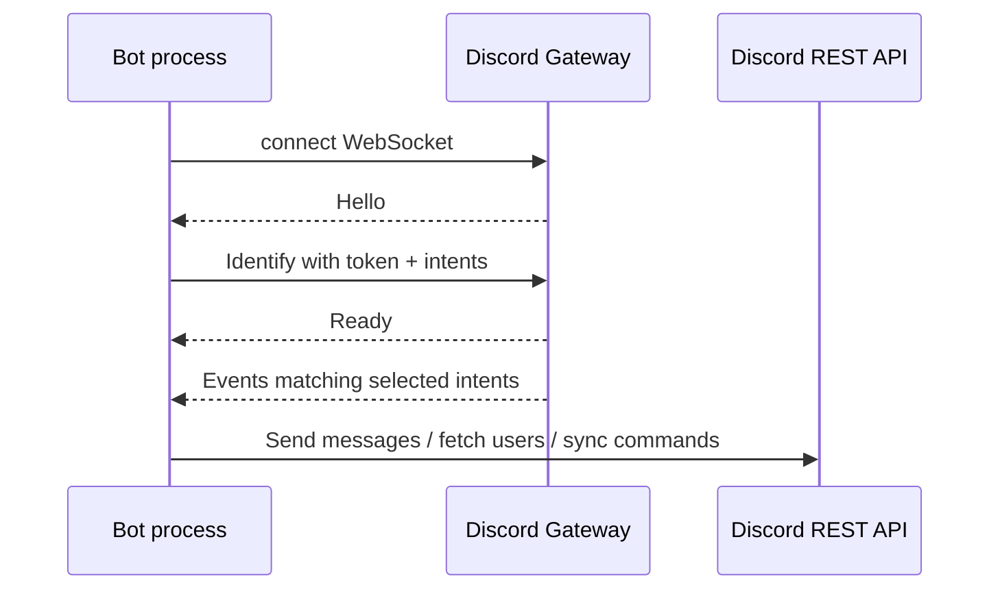

# 05. Gateway, Events, And Intents

The Gateway is Discord's WebSocket event connection. A connected bot receives events such as ready, messages, interactions, guild/member updates, and presence/activity updates.

`discord.py` hides most raw Gateway protocol details, but the model still matters.



## What Are Intents?

Intents are event/data subscriptions. They tell Discord what categories of events your bot wants.

In `main.py`:

```python
intents = discord.Intents.default()
intents.message_content = True
intents.members = True
intents.presences = True
```

## Why ConcentrateBot Needs These

| Intent | Why this project uses it |
| --- | --- |
| Message content | Prefix commands like `!ping`, `!reset`, `!reloud_all` |
| Members | Game detection loops through guild members |
| Presences | Game detection reads `member.activities` |

## Privileged Intents

Some intents are privileged because they expose sensitive user/server data. These usually need to be enabled in the Discord Developer Portal and may require review for larger apps.

For this bot, presence/activity detection is the most important privileged-data area.

## Event Sources In This Repo

| Code | Event/loop style |
| --- | --- |
| `on_ready` | Gateway ready event |
| `on_message` | Message event for prefix commands |
| `@app_commands.command` | Slash command interaction event |
| `@tasks.loop(seconds=10)` | Local scheduled loop, not a Discord event |
| `member.activities` | Cached presence/activity data from Gateway |

## Official Docs To Read

- Gateway: https://docs.discord.com/developers/events/gateway.md
- Gateway Events: https://docs.discord.com/developers/events/gateway-events.md
- Getting Started with Privileged Intent Review: https://docs.discord.com/developers/gateway/getting-started-with-privileged-intent-review.md
- You Might Not Need a Privileged Intent: https://docs.discord.com/developers/gateway/you-might-not-need-a-privileged-intent.md
