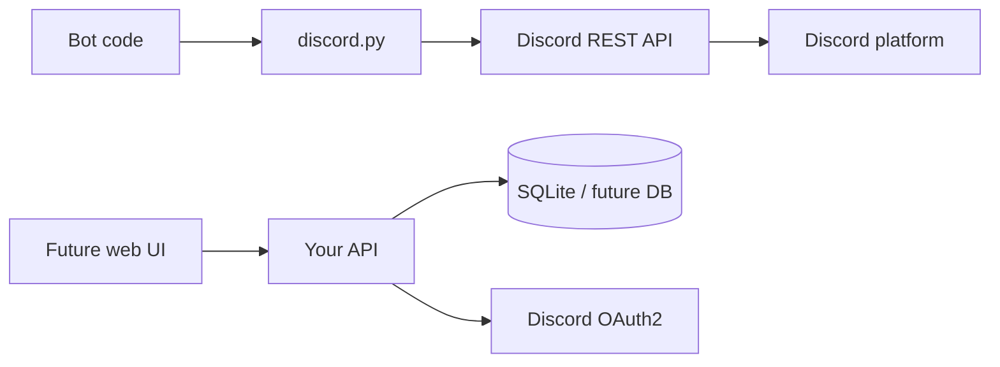
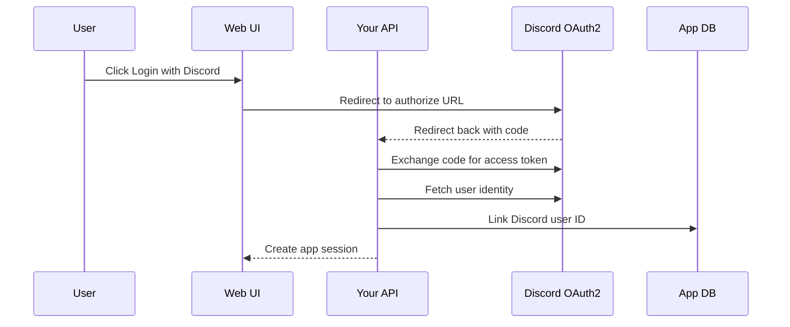

# 06. REST API, OAuth, And Permissions

Discord also has an HTTP REST API. Bot libraries call this API for you when they send messages, register commands, fetch users, edit messages, and so on.

For your web UI, Discord REST/OAuth matters mostly for login and identity.

## REST API Mental Model



## Bot Token vs OAuth User Token

| Token type | Belongs to | Use |
| --- | --- | --- |
| Bot token | Bot application | Bot actions, Gateway login, API calls as bot |
| OAuth user access token | User authorization | Login with Discord, read allowed user data |

Do not put either token in frontend code.

## Scopes And Permissions

| Concept | Meaning |
| --- | --- |
| OAuth2 scope | What category of access the app is asking for |
| Bot permissions | What the bot can do inside a server |
| Application commands scope | Allows installing/registering commands |
| Guild permissions | Server-specific permission system |

Common install scopes:

```text
bot
applications.commands
```

Common future web login scopes:

```text
identify
guilds
```

Use only what the app needs.

## Rate Limits

Discord APIs are rate limited. Good libraries such as `discord.py` handle common cases, but custom HTTP calls from your future API should respect rate limit headers and avoid spammy loops.

For ConcentrateBot:

- DB reads/writes are local and not Discord rate limited.
- Sending many DMs can hit Discord API limits.
- Syncing commands too often can hit command registration limits.

## Future Web Login Flow



## Official Docs To Read

- API Reference: https://docs.discord.com/developers/reference.md
- OAuth2: https://docs.discord.com/developers/topics/oauth2.md
- OAuth2 & Permissions: https://docs.discord.com/developers/platform/oauth2-and-permissions.md
- Permissions: https://docs.discord.com/developers/topics/permissions.md
- Rate Limits: https://docs.discord.com/developers/topics/rate-limits.md
