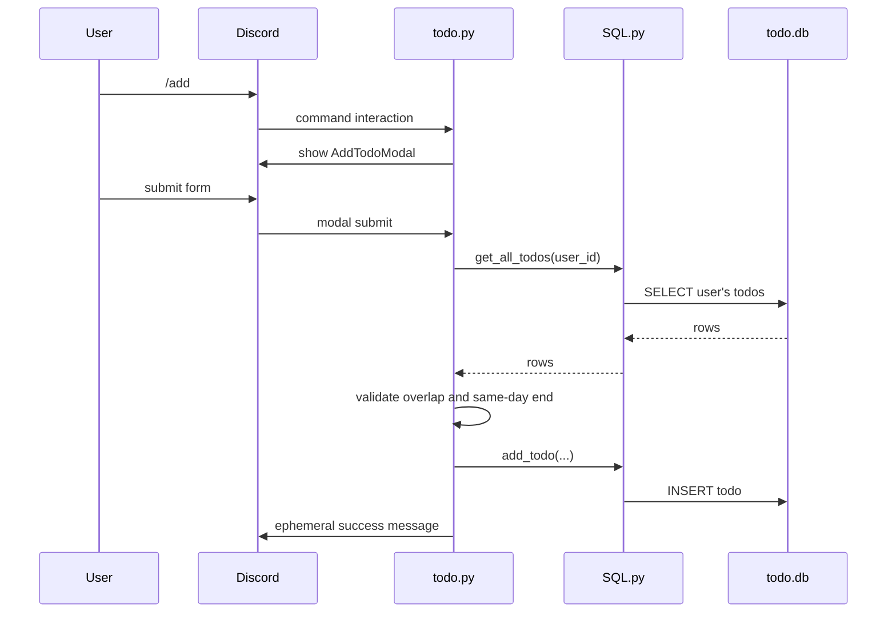
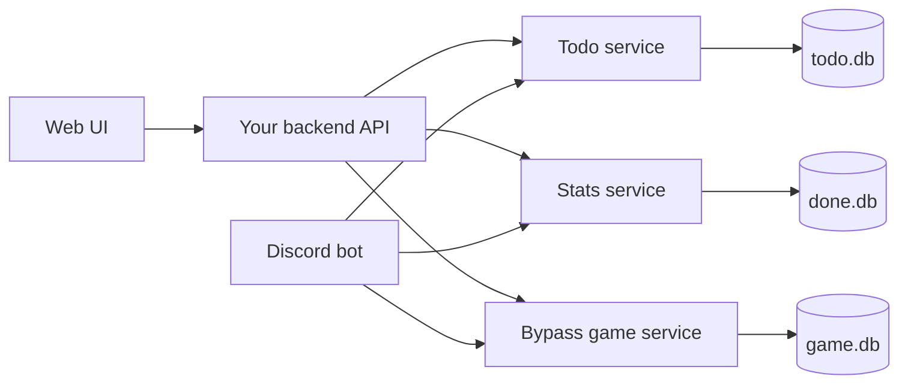

# 07. Mapping Official Docs To ConcentrateBot

This file maps Discord concepts back to this project.

## Feature Map

| User feature | Discord docs concept | Repo file | Data touched |
| --- | --- | --- | --- |
| Add todo | Slash command + modal | `dm_cogs/cogs/todo.py` | `todo.db` |
| View todos | Slash command + embed | `dm_cogs/cogs/todo.py` | `todo.db`, `done.db` |
| Complete todo | Slash command + select + button | `dm_cogs/cogs/todo.py` | `todo.db`, `done.db` |
| Start reminder | Scheduled loop + DM + button | `dm_cogs/cogs/check_date.py` | `todo.db` |
| End reminder | Scheduled loop + DM + button | `dm_cogs/cogs/emdtime.py` | `todo.db` |
| Add bypass game | Slash command + presence/activity data | `dm_cogs/bypasswhat.py` | `game.db` |
| Detect game during focus | Gateway presences + scheduled loop + DM | `dm_cogs/checkgame.py` | `todo.db`, `game.db` |

## End-To-End Add Todo



## End-To-End Game Warning

```mermaid
sequenceDiagram
    participant Loop as checkgame loop
    participant TodoDB as todo.db
    participant Discord as Discord gateway cache
    participant GameDB as game.db
    participant User as User DM

    Loop->>TodoDB: get_all_game_check(now)
    TodoDB-->>Loop: active focus users
    Loop->>Discord: read guild members and activities
    Loop->>GameDB: get_all_bypass(member.id)
    GameDB-->>Loop: allowed game IDs
    Loop->>Loop: compare current game vs allowed IDs
    Loop->>User: DM warning if not allowed
```

## What Your Web UI Should Use

The UI should care about app data, not Discord internals.

Recommended API resources:

```text
users
todos
weekly-stats
bypass-games
```

Suggested UI/API architecture:



Right now the bot imports database helpers directly. A future cleanup could move those helpers into shared service modules, then both the bot and API can reuse the same validation.

## API Contract Sketch

```http
GET /api/users/{discordUserId}/todos
POST /api/users/{discordUserId}/todos
PATCH /api/users/{discordUserId}/todos/{todoId}/done
PATCH /api/users/{discordUserId}/todos/{todoId}/end-time
DELETE /api/users/{discordUserId}/todos/{todoId}

GET /api/users/{discordUserId}/weekly-stats

GET /api/users/{discordUserId}/bypass-games
POST /api/users/{discordUserId}/bypass-games
DELETE /api/users/{discordUserId}/bypass-games/{gameId}
```

## Questions To Ask Your Teammate

1. Should the web UI use Discord login now, or start with manual Discord user ID input?
2. Should todos support dates, or only today's schedule?
3. Should the UI be allowed to add bypass games manually, or only display what Discord detected?
4. Should the API be Python/FastAPI, Node/Express, or your existing web stack?
5. Should completion analytics count only `/done`, or also tasks that reached end time?

## Minimum Concepts To Understand First

If you only study five things, study these:

1. Slash commands create interactions.
2. Interaction responses are how the bot replies to slash commands, buttons, selects, and modals.
3. Gateway events are how a long-running bot receives Discord events.
4. Intents control which event/data categories the bot can receive.
5. OAuth2 is separate from bot login and is what a web UI would use for Discord user login.
