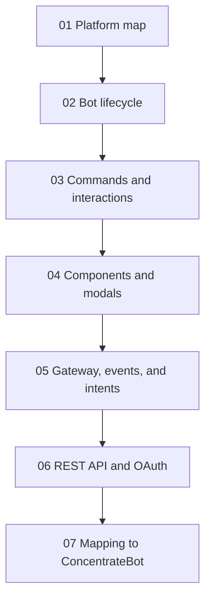

# Discord Official Docs Study Pack

This folder is a study guide for understanding Discord bot/app development from a web/full-stack engineer point of view.

It is not a copy of the official docs. It is a project-focused learning pack based on the official Discord Developer Documentation, with links back to the source pages.

## Study Order

## Files

| File | Use it for |
| --- | --- |
| [01-platform-map.md](./01-platform-map.md) | Big-picture Discord architecture |
| [02-bot-lifecycle.md](./02-bot-lifecycle.md) | How a bot connects, starts, and listens |
| [03-commands-and-interactions.md](./03-commands-and-interactions.md) | Slash commands and interaction responses |
| [04-components-and-modals.md](./04-components-and-modals.md) | Buttons, selects, and modal forms |
| [05-gateway-events-intents.md](./05-gateway-events-intents.md) | Gateway events, intents, and privileged data |
| [06-rest-api-oauth-permissions.md](./06-rest-api-oauth-permissions.md) | HTTP API, OAuth2 scopes, bot permissions |
| [07-concentratebot-mapping.md](./07-concentratebot-mapping.md) | How the docs map to this repo |

## Official Source Links

- [Discord Developer Platform](https://docs.discord.com/developers/intro)
- [Discord Bots & Companion Apps](https://docs.discord.com/developers/bots/overview.md)
- [Application Commands](https://docs.discord.com/developers/interactions/application-commands)
- [Receiving and Responding to Interactions](https://docs.discord.com/developers/interactions/receiving-and-responding)
- [Interactions Overview](https://docs.discord.com/developers/interactions/overview.md)
- [Components Overview](https://docs.discord.com/developers/components/overview.md)
- [Using Message Components](https://docs.discord.com/developers/components/using-message-components.md)
- [Using Modal Components](https://docs.discord.com/developers/components/using-modal-components.md)
- [Gateway](https://docs.discord.com/developers/events/gateway.md)
- [Gateway Events](https://docs.discord.com/developers/events/gateway-events.md)
- [OAuth2 & Permissions](https://docs.discord.com/developers/platform/oauth2-and-permissions.md)
- [API Reference](https://docs.discord.com/developers/reference.md)
- [Rate Limits](https://docs.discord.com/developers/topics/rate-limits.md)
- [Permissions](https://docs.discord.com/developers/topics/permissions.md)
